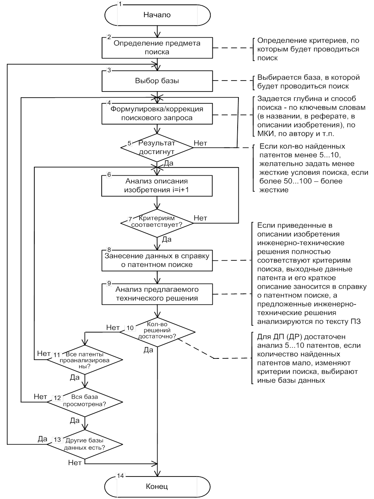
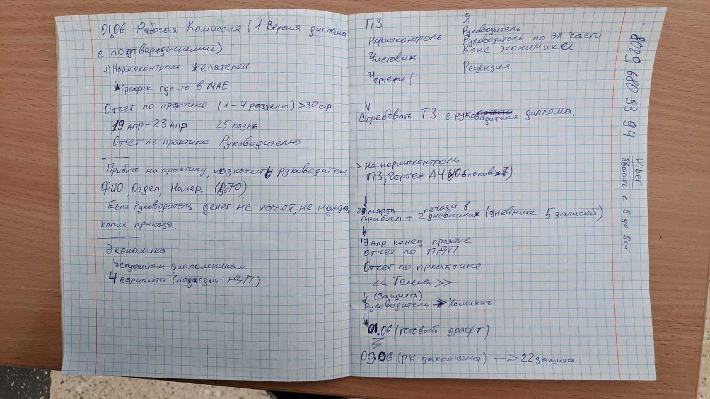

# Info

Backup:
> https://github.com/isadora-6th/my-precious-dp

Тема:
Однонаправленная ведомственная сеть

Keywords:  
- Диод данных
- Межсетевой экран
- Устройство однонаправленной передачи (диод) данных
- Однонаправленная сеть

Руководитель:
Лукашевич

## Checklist
1. Понять как делать титульный лист
2. Сделать **Основу** док со стилями
3. Задание на дипломное проектирование (оно же ТЗ?)
4. Введение, постановка задачи
    
 
    
SRC: общие требования, стр 19 

    Во  введении  указываются  основные  тенденции  развития  соответствующих отраслей инфокоммуникаций в Республике Беларусь (в соответствии с темой  дипломного  проекта/работы):  систем  и  средств  проводной,  оптической  и радиосвязи, теле- и радиовещания, сетей телекоммуникаций различного назначения.  Кратко  излагаются  назначение  и  важность  разрабатываемой  системы (устройства),  проектируемой  сети,  обосновываются  актуальность  и  необходимость разработки, формулируются цели и задачи дипломного проектирования. 
    

5. Анализ аналогичных устройств.
    - http://search.ncip.by/database/
    - https://www.eapo.org/ru/?patents=reestr
    - https://patentscope.wipo.int/search/ru/search.jsf
    - https://ru.espacenet.com/
    - > src: https://www.bsuir.by/m/12_113415_1_98996.htm
    
 
    
Схема с .pdf о патентном поиске 

    
    

6. Обоснование требований задания на дипломное проектирование
    - Брать в требованиях (там есть приложение)

## Расписание

 
    
Пик тетрадки 

    

## Патентный поиск
- https://www.anti-malware.ru/analytics/Market_Analysis/Data-Diodes

## Текста для воды  
 - https://www.anti-malware.ru/analytics/Technology_Analysis/Data-Diodes (used)
 - https://en.wikipedia.org/wiki/Unidirectional_network
 - https://www.securitylab.ru/contest/409633.php

## Экономика
> SRC: https://vk.com/im?sel=c64&msgid=713165
- 10/11 раздел (мне 10ый)

> SRC: https://vk.com/im?sel=c64&msgid=712060
Слюсарь Тамара Леонидовна	
Вторник 1,3 уч. н. 15.20 810-5
tamara_econ@mail.ru
